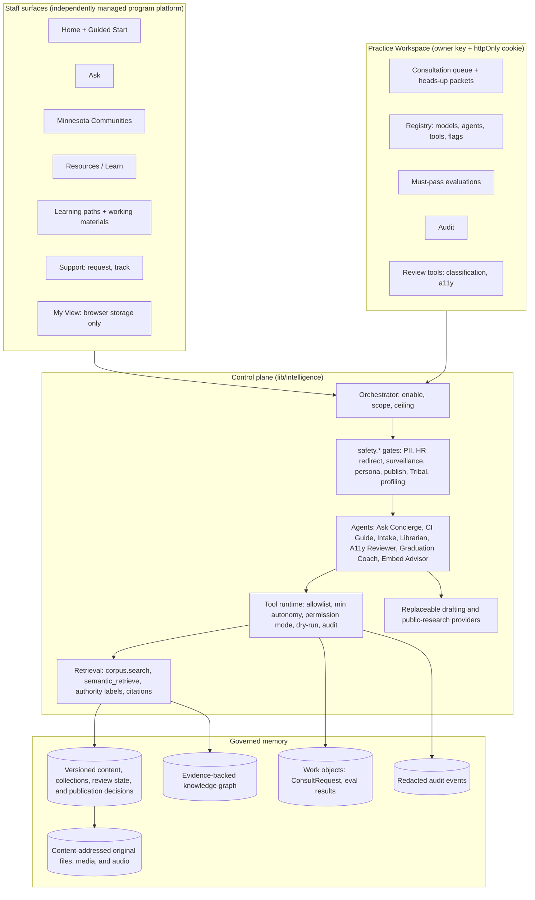

# One DHS PAC: application and corpus architecture

## Current architecture requirements

[OWNER-2026-09-07-DIGITAL-MING](OWNER-DIRECTIVE-2026-09-07.md) supersedes the conflicting baseline below. Add durable ASK question/response records and inspectable agent-work receipts under appropriate access control. Consultation is no longer the only intended persisted staff-authored work. These records do not become cross-user conversational memory or employee scoring.

Treat the owner's supplied and curated content as already approved. Preserve immutable sources, revision/publication/withdrawal history, and actual technical checks; remove repeated content-approval barriers. Support the Chief of Staff's completion of authorized tasks and maximum program autonomy, with the owner retaining stop/control.

The following diagram, A1/A2 route map, environment defaults, and dated staging counts preserve the earlier implementation. Their absolute ASK nonretention, intake-only approval, and fixed A2 language are superseded requirements. They do not establish the current configured state or prove that the new records and autonomy have shipped.

## Historical implementation baseline

Roadmap steps B10 to B12. This document is the system context, the route and agent invocation map, and the environment, secrets, and eval-hook layout for the Early-2027 MUST slice.

## A0. System context

Boundaries:

- Staff routes are brand-scrubbed and every control has an understandable text label (KPI-04). Internal vocabulary appears only under `/consultant`.
- **Historical, superseded by the September 7 records requirement:** Ask transcripts are never stored server-side (retention is decision T-03). The browser tab holds the session.
- **Historical, superseded by the September 7 records requirement:** Consult requests are the only staff-authored work objects persisted server-side, and only after every free-text field passes the PII gate.
- No adapter exists for case, HR, publish, send, ranking, or Tribal-affiliation inference (Catalog §5). A test enforces this.
- **Historical, superseded for owner-curated content:** Owner approval allows a source to enter the intake corpus. Staff release is a different decision and requires the applicable language, currentness, accessibility, scope, placement, rights, and representation reviews.
- The 25 current seed items form a permanent append-only collection. Historical, merged, internal, and donor records remain available for review without becoming staff-visible by default.
- Staff-facing pages never display raw accounting language. When useful, they show plain labels such as owner, applies to, contact, and next review.

## A1. Route map and agent invocation boundaries (A0 to A2)

| Route | Kind | Agent (ceiling) | Tools invoked | Human gate |
| --- | --- | --- | --- | --- |
| `/` | static | none | none | n/a |
| `/guided-start` | static + client | Graduation Coach (A1) in-browser, pure | learn.path_recommend | user chooses |
| `/ask` + `POST /api/ask` | dynamic | Ask Concierge (A2) | safety.*, corpus.semantic_retrieve, corpus.search, citation.attach, conflict.surface, embed.question_bank, answer.structured_draft, graduation.next_practice | preview (answer is a draft with sources and limits) |
| `/minnesota-communities[?q=]` | dynamic | CI Guide (A2) | community.brief_list, corpus.search (released brief kind), safety.* | publication decision |
| `/minnesota-communities/[id]?level=2` | dynamic | CI Guide (A0) | community.brief_get | none |
| `/resources`, `/resources/[id]`, `/learn` | dynamic/static | none (retrieval only) | corpus.search over the released collection | publication decision |
| `/paths/[id]` | dynamic + client | Graduation Coach (A2) in-browser | selfCheck, safety.pii_detect (client copy) | user owns artifact |
| `/support/request` + `POST /api/intake` | dynamic | Consultation Intake (A2) | intake.form_assist, safety.*, queue.rank_suggest, intake.summary_pack, agenda.consult_prep_draft, calendar.handoff_prep, corpus.search, embed.question_bank | share confirmation; preview before submit |
| `/support/track` + `GET/POST /api/intake/[id]` | dynamic | Consultation Intake (A0/A2) | queue.status_get, queue.status_set (withdraw) | requester holds access key |
| `/consultant/*` | dynamic, owner | Consultation Intake (owner role), Librarian, A11y Reviewer, Eval Steward | queue.status_get/set, resource.classify_draft, resource.stale_detect, a11y.scan_draft, eval.run_cases | owner disposition |

Runtime enforcement (lib/intelligence/tools/runtime.ts): a tool call is denied unless it is registered and enabled, in the agent's allowlist, at or below the agent's ceiling and the environment maximum (A2), and, for owner-only tools, called with the owner role. Side-effect tools honor dry-run. Every call emits a redacted audit event.

Degraded behavior: retrieval and browse never depend on a generative provider. If the vendor pilot is on and fails, Ask falls back to the fixture composition and marks the answer degraded with plain-language copy.

## A2. Environment, secrets, provider stubs, logging and eval hooks

| Concern | Where | Default |
| --- | --- | --- |
| Owner key | `PAC_OWNER_KEY` | locked in production if unset; labeled dev default in development |
| Store backend | `PAC_STORE` = memory, file, or PostgreSQL | the selected staging environment uses portable PostgreSQL through a restricted runtime role; file and memory remain local fallback modes |
| Generative pilot | `PAC_GENERATIVE_PILOT` + `ANTHROPIC_API_KEY` | off; fixture composer is production |
| Under-review briefs | no staff-facing switch | excluded from staff browse, direct access, search, and Ask; a future preview requires a separate protected owner-only reader |
| Model registry | `lib/intelligence/registry/models.ts` | fixture records in production; vendor records candidate/pilot |
| Agent definitions | `lib/intelligence/registry/agents.ts` | 8 MVP agents enabled; Sentinel disabled; Eval Steward read paths |
| Feature flags | `lib/intelligence/registry/flags.ts` | A3 experiments off; near-term tools off |
| Audit | `Store.appendAudit` | codes and IDs only; never payloads |
| Eval harness | `lib/intelligence/eval/runner.ts`, `/consultant/evals`, `npm test` | ASK-E1..10, CI-E1..8, CIQ-E1..10, GP-E1..10, MIND-A/B/C, CP-1/2 |
| Copy gate | `tests/staff-routes-brand.test.ts` | fails the build on banned terms, emoji, or svg in staff routes |

No secret is committed. `.env.example` lists every variable.

## A3. Corpus layers and import boundary

The content store uses separate layers so that accounting does not become publication:

1. Source carriers and receipts preserve every supplied location, original hash, duplicate relationship, and missing-source state.
2. Immutable content revisions preserve original and edited versions. A later edit never overwrites the source revision.
3. Collection membership records the permanent seeds, historical catalog, canonical families, active child resources, supplied materials, donor courses and briefs, and future administration-specific views.
4. Review records separately track staff voice, currentness, accessibility, scope, placement, rights, and representation.
5. Publication decisions are explicit and reversible. Only a released revision may enter staff browse, retrieval, Ask, or direct access.
6. Search chunks and graph edges point back to the exact content revision and supporting source receipt.
7. Original files and audio use content hashes in object storage; the relational store holds metadata and relationships rather than duplicating large binaries.

The import is idempotent. Repeating the same source and hash is a no-op; the same stable ID with different content is a hard conflict that requires a new revision or an owner decision. Shadow mode completes reconciliation and review without changing the staff collection.

## A4. Activated staging data plane

As of September 5, 2026, Supabase project `qhiawdhehhfuccxvhldo` is the selected and active staging data plane. It is not a DHS, ADSA, or DSD system. The portable PostgreSQL schema and restricted application runtime role are live there. The application role can call the fixed staff and owner functions it needs, but direct reads of protected tables are denied with PostgreSQL code `42501`.

The read-only migration check reports all eight migrations applied with no database change:

| Migration | SHA-256 | State |
| --- | --- | --- |
| `0001_pac_content_foundation.sql` | `7C1C2BE6DE36A2611A9BDB9E3BD54B193FF8A2D94D0F0004E762AFBE7C692AE8` | applied |
| `0002_pac_runtime_store.sql` | `D77309AE6A10118C3A8BDAEDE95EB65D10B446535445287ED046A35885456BE5` | applied |
| `0003_pac_private_source_objects.sql` | `439BB36C39310B4CFF3133C42639B87C93C47EC1360F1FA862B086D798AB1CA9` | applied |
| `0004_pac_scoped_staff_publications.sql` | `0FEA988865E7D13AB3522C813EAEFE35F389A24FD2D491A5FA4B3379AE94CE6B` | applied |
| `0005_pac_owner_resource_drafts.sql` | `AE4F61D7C53EAD33CEDC8981918AF99BD085017A7E6A53F8EF2D8E98E0BF49F3` | applied |
| `0006_pac_owner_resource_release.sql` | `CB8561EEAFB7DA175E2C11639FE9CC52481FCF4A7250C744114F20D12FF68FFD` | applied no-op |
| `0007_pac_home_footer_content.sql` | `8B1FCE29CF8D0D69DA59088EF920CB1426E23F4427FD20FAD6273D08D5FE08C9` | applied |
| `0008_pac_owner_resource_release.sql` | `E11AE49A4DCEA56756CAF5BC2E81176990A6CD7C8BD4BC5ED50A92680653AFFF` | applied |

Migration `0006` is an accidental 60-byte placeholder containing only a transaction-wrapped no-op. It changed no data, permissions, or behavior. It remains in the immutable migration history so the applied ledger stays truthful. The implemented resource-release migration is `0008`.

## A5. Loaded corpus, staff readers, and release boundary

The staging database contains these completed, replay-safe loads:

| Load | Run ID | Rows recorded |
| --- | --- | ---: |
| Shadow source history | `bac47fd8-6fc5-4e52-bc49-030fb847b8ff` | 1,207 |
| Canonical projection | `3993ae55-e95b-4766-b9e8-35f995abbd0e` | 1,803 |
| Permanent seed release | `c7b5f76e-571d-4393-90d1-87b8c6065751` | 223 |

Before page blocks, the store held 44 source carriers, 630 source items, 98 content items, and 122 revisions. Home and Footer added two source carriers, two source items, two content items, and two revisions, producing these current totals:

| Record type | Count |
| --- | ---: |
| Source carriers | 46 |
| Source items | 632 |
| Source receipts | 557 |
| Content items | 100 |
| Content revisions | 124 |
| Collection memberships | 98 |
| Publication decisions | 27 |
| Preserved legacy events | 574 |

The general staff resource reader returns exactly the 25 permanent seed resources. Home and Footer each use a separate, fixed page reader; their two publication decisions do not enter Resources or Ask retrieval. No imported historical, canonical, internal, held, or page-block record is released through the general resource reader.

Inline owner editing currently covers resources and the Home and Footer copy blocks. It does not yet cover every staff-facing program surface. Additional typed editors and release checks are required before the program satisfies the edit-anywhere requirement.

The source-object stage accounts for 60 content-addressed representations totaling 46,613,473 bytes. None has been uploaded. Upload remains blocked until the owner gives specific authorization for that exact package and private staging destination.

Vercel Preview variables for the restricted PostgreSQL runtime are configured. Production variables are not configured, and this activation has not been deployed to production. The Perplexity credential is also absent, so outside research remains unavailable until that separate connection is authorized and configured.
