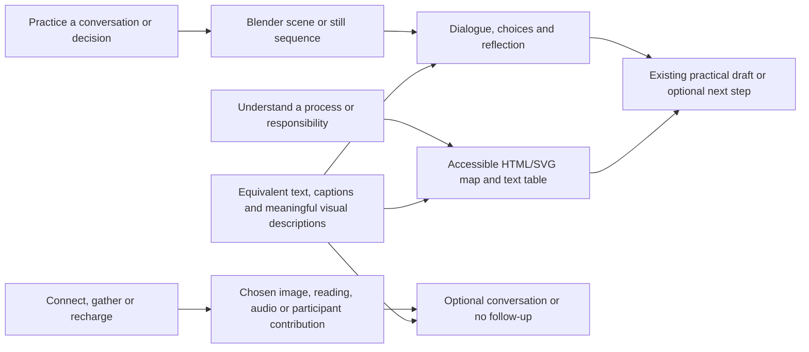

# Multimedia opportunities: One DSD, leadership, engagement and orientation

Internal review for Gary Banks and the program builders. September 9, 2026.

This review identifies where media can make existing explanations, decisions, practice and voluntary connection more useful. It covers the assigned local route families and their actual content definitions and interactive components. It is a design assessment, not a live-site, external-link, institutional-policy or accessibility certification. No staff content, artwork, publication state, records or deployment was changed. The separate office demonstration remains separate from the staff program.

The strongest first additions are short, replayable examples of a meeting, an interview deliberation and an accessible service conversation, followed by the existing questions and practical tools. Organizational relationships, participation choices, process ownership and evidence limits are better explained through accessible diagrams and editable examples. Blender is useful for authored scenes and visual sequences; it should not become the default medium for every page.

## Scope and complete family accounting

Eighteen route source files were inspected, representing 41 concrete destinations when the 12 program IDs and 13 scenario IDs are expanded. This is the complete assigned family inventory; it is not a claim to have browser-tested all destinations or revalidated their external references.

| Family | Coverage of local implementation and content | Media and interaction present | Specific gap |
| --- | --- | --- | --- |
| One DSD home | All home sections, four program doors, program/scenario inventory and publication-filtered links | Text, grouped links and program/scenario listings | No visual explanation of how a work question connects a program, a responsible role, a resource and a next action |
| One DSD Team and Learning Lab | Both routes; all ten Team sections; five Lab topic invitations; the four-part conversation structure | Team photograph; shared connection graphic; idea-brief tool and links | No worked example of observing a process, exploring it with colleagues, agreeing a contribution and returning to the result |
| Amplify | All seven routes: home, gatherings, mentoring, well-being, ideas, co-leads and materials | One home photograph; two-way connection graphic; activity filters; invitation/plan, mentoring-outline and idea-brief generators; copy and text download | No embedded demonstration clips, illustrated facilitation sequence or example-to-draft handoff |
| Leadership | Three entry paths; all six capabilities; ten employee-life-cycle stages; development map, reflection and continuity tools; eight linked workforce resources | Shared Team photograph; interactive selectors, explanatory scenarios, reflection forms and text downloads | No worked visual example of a criterion, supported opportunity, accommodation handoff or tested knowledge transfer |
| DSD program profiles | All 12 profiles, domain relationships, equity entry points and related-scenario links | Text and related links | No compact visual comparison of functions, handoffs and entry points |
| DSD practice scenarios | All 13 situations, observations, questions, moves and professional handoffs | Complete text situations and resource links | No authored image/video sequence or interactive scene branches on these routes |
| Orientation, Start, Guided Start | Twelve orientation doors; Start's 11 role choices, nine work areas and four urgency choices; Guided Start redirects to Start | Text directory; validated routing form; recommendation links; shared connection graphic | No optional visual route finder or concise worked routing example |
| Employee resource groups | DHS current-source references, historical references and separate statewide network; all three program-connection suggestions | Text cards and links | No group-authored media; current participation arrangements remain with each group's own information |
| Understanding DHS | All 30 source-backed entries across five groups, not selected examples only | Group navigation, topic cards, related units and source links | No maintainable relationship map, responsibility comparison or linked process diagram |

The source-level media search found two distinct photographs in these families: `one-dsd-planning-together.webp` reused on Team and leadership, and `program-workplace-conversation.webp` on Amplify home. No embedded audio or video player was found in the reviewed routes/components. A gathering activity links to existing program podcasts elsewhere; that link does not establish an embedded excerpt, transcript or playback control on the gathering page. The shared “How we connect” component already provides two text cards with a bidirectional arrow. Preserve and build on those useful elements.

All twelve Amplify activities were read: A little joy; Minnesota through our eyes; The story behind it; Borrow a good idea; The question we share; Listen, then linger; What I wish I had known; A window into my work; One less friction; A pause that fits; Opportunity exchange; Small kindnesses. Not every activity needs new media or a work product.

All leadership stages were read: design, recruit, interview, onboard, everyday contribution, develop, advance, retain, succession and transition. The entry paths are exploring, encouraged and practicing. The six capabilities concern evidence, communication, access, opportunity, decisions and continuity. The map's seven planning fields and three return/reflection fields are already useful destinations for learning.

The eight linked resource records read in the local workforce corpus were: inclusive hiring lifecycle, job-relatedness check, pay/classification/advancement, mentoring/sponsorship/reverse mentoring, stay conversations, accessible leadership pathways, leadership criteria job-relatedness, and accommodations across transitions. Original source wording is preserved; this review does not turn their examples into new deadlines, assigned staff work or official requirements.

## Priority opportunities

Priorities express instructional value and reuse, not a promised delivery schedule. “Ready to storyboard” means the local content supplies a concrete starting point; it does not mean an asset has been authored, reviewed for accessibility, attached or published.

### 1. Replay a meeting and change the participation conditions — high priority

**Placement:** Learning Lab after “A light structure for a useful conversation”; the Team's practice cycle; `/one-dsd/scenarios/dsd-team-silence`; an optional companion on Amplify co-leads.

**Purpose and example:** Show a fictional meeting where a rapid verbal discussion moves directly to a conclusion while a written contribution remains unread. Pause before the conclusion. Ask what was observed, what remains unknown and which change could help. Replay with advance questions, quiet thinking time, written contributions and an explicit explanation of what changed after input. A second short example can show a leader naming a specific problematic comment and inviting clarification or repair without assigning motives.

**Media and Blender fit:** Three to five still frames first; later a short captioned animation with separately selectable responses. Blender is a strong fit for a reusable abstract meeting set. Narrative meaning belongs in dialogue, actions and decisions; appearance or posture must not encode a cultural explanation.

**Equivalent and work product:** A text scene with descriptions of meaningful actions, all dialogue, keyboard-accessible choices and identical feedback; captions/transcript for motion. Follow with a meeting-adjustment note or the existing idea brief. No speed score or diagnosis.

**Readiness:** Ready to storyboard from existing scenarios. The local Blender studio can create editable scenes and still previews; a real branching lesson and video delivery would be additional work. Keep original scenarios recoverable.

### 2. Show what an interview panel can actually support with evidence — high priority

**Placement:** Leadership `?stage=interview#life-cycle`; `dsd-hiring-panel`; links from the job-relatedness and inclusive-hiring resources.

**Purpose and example:** Present a fictional answer and a panel's first impression. Ask the learner to identify the actual competency evidence and an unsupported inference. Replay the panel using an agreed criterion and an explanation tied to the answer. The existing eye-contact example can support observation versus interpretation without claiming why an applicant looks down.

**Media and Blender fit:** A short authored interview/panel sequence plus a readable side-by-side “observation / interpretation / criterion evidence” example. Blender supports consistent fictional staging; ordinary HTML is better for the rubric and answer comparison.

**Equivalent and work product:** Full dialogue and action description, untimed text comparison, captions and transcript. Product: a practice assessment explanation or a revised job-related criterion, connected to `/paths/gp-6`.

**Readiness:** Ready to storyboard and develop a fictional work sample. Actual selection procedures remain with the appropriate partners and sources. This is practice, not an operational hiring decision or a claim that a cultural group behaves a certain way.

### 3. Follow an accessible service conversation from first contact to a usable next step — high priority

**Placement:** `dsd-service-redesign`, `dsd-interpreter-first-contact` and `dsd-accessible-form`; related entry points in MnCHOICES, support planning and communications/training profiles.

**Purpose and example:** Compare an online-only step, a first phone call and a supported alternative. A fictional person states the language/format/help they need; the process adapts to that stated preference. Let staff trace who provides the next usable step and where responsibility currently disappears.

**Media and Blender fit:** A compact service-counter or conversation scene beside an accessible journey diagram. Blender is useful for the interpersonal moment. HTML/SVG and a screen demonstration are better for form structure, status and handoffs. Do not simulate a screen reader through visual effects or blur; demonstrate accessible content directly.

**Equivalent and work product:** A complete ordered journey with accessible form examples, spoken information in text and text alternatives for meaningful visual details. Product: a burden/access map and an identified role to consult, not a client eligibility determination.

**Readiness:** Generic fictional storyboard is possible now. Any actual service procedure, rights statement or contact must use the relevant current source before distribution. A still scene is not evidence that an intake service or accommodation route has been fixed.

### 4. Make the agreed question and report-back visible — high priority

**Placement:** Amplify ideas, co-leads and materials; the shared “How we connect” area; `dsd-report-back` and `dsd-engagement-late`.

**Purpose and example:** Show a short sequence: a gathering notices an issue → participants choose whether and what to share → a willing recipient receives the agreed question → a response returns, including what remains undecided. Include an equally valid “keep this as a conversation” branch. Distinguish an open decision from an announcement of a decision already made.

**Media and Blender fit:** A two-dimensional step diagram and a worked, editable invitation/question/update set are the best fit. A Blender meeting image can introduce the example, but a 3D pipeline would make wording, consent and ownership harder to inspect.

**Equivalent and work product:** Ordered text with the same branches, source wording and an editable report-back example. Product: the current idea brief or “question to carry forward” template, with the intended recipient and sharing boundaries left as proposals until agreed.

**Readiness:** Strong near-term candidate because the templates and draft tools already exist. It needs no new staff-record collection and must not automatically record, transcribe, submit or circulate real gatherings.

### 5. Show the difference between advice, access and supported practice — high priority

**Placement:** Amplify mentoring; leadership develop/advance; `dsd-advancement-conversation` and `dsd-accommodation-cliff`; accessible-pathway and accommodation-transition resources.

**Purpose and example:** A fictional colleague asks to develop a specific capability. Compare encouragement alone with an opportunity that includes time, access arrangements, feedback and a way to express interest. In a second beat, show how an agreed participation arrangement is handed over during a rotation without transmitting a diagnosis.

**Media and Blender fit:** Short conversation storyboard with a clear annotated opportunity plan. Blender suits the conversation; accessible text/diagram is better for responsibility at each transition.

**Equivalent and work product:** Complete dialogue, alternatives and action descriptions; editable text outline. Product: an existing mentoring outline or development map with a proposed practice opportunity and support needs. No promise of mentoring matches, appointments, advancement or an actual accommodation decision.

**Readiness:** Ready to storyboard with the existing content. Use the person’s stated goal and preferences; do not infer identity, disability, capability or ambition from appearance, speech or participation.

### 6. Demonstrate a handover that someone can actually use — medium priority

**Placement:** Leadership succession/transition, `#continuity-plan`, capability “Share knowledge and build future capability”; Team's useful work note and continuity sections.

**Purpose and example:** Compare a folder of files with a fictional handover that explains a decision, a recurring task, exceptions and the role to contact. Show a colleague attempting the task and the author revising what was missing. Connect this to transparent opportunities to practice critical work.

**Media and Blender fit:** A short screen demonstration or annotated document is strongest; optional introductory scene in Blender. The essential evidence is whether the instructions work, so detailed room animation adds little.

**Equivalent and work product:** Accessible sample handover, task instructions and a narrated/described walkthrough. Product: the existing continuity plan plus a practical check and a question for feedback. Discuss functions and capability, never a ranked list of successors.

**Readiness:** Ready for a synthetic example. The current tools generate text drafts and require copy/download before leaving; do not depict a persistent portfolio or an automatic sharing workflow that the implementation does not supply.

### 7. Give gathering choices useful previews and editable materials — medium priority

**Placement:** All twelve gathering cards; selected `#gathering-plan`; Amplify materials.

**Purpose and example:** Show what “Borrow a good idea,” “A window into my work” or “Listen, then linger” could look like using a small visual preview and a real, readable sample plan. Use a consistent legend for preparation, participation options and optional follow-up. Keep joy, celebration, listening and passing valid ends in themselves.

**Media and Blender fit:** Mostly editorial images, accessible illustrations and document previews. A few Blender stills can represent room arrangements; they should not replace actual public artwork, manufacture community traditions or imply that a generic render documents a real gathering.

**Equivalent and work product:** Text descriptions and equivalent readable sample plans. For a selected podcast excerpt, provide a precise excerpt reference and text companion; an unrelated reading is not automatically an equivalent transcript. Product: the existing invitation/plan when useful; no mandatory artifact.

**Readiness:** Ready for selected pilot previews. Source permissions/attribution must be established for any third-party contribution. Gathering times and dates stay in editable confirmed logistics, not baked into imagery.

### 8. Make working conditions visible without prescribing a wellness routine — medium priority

**Placement:** Amplify well-being; “A pause that fits”; leadership retain/everyday stages.

**Purpose and example:** An optional quiet scene can support a pause. Separately, show an annotated working day where conflicting priorities, inaccessible meetings or lost development time create friction. Ask which condition could change and whose perspective is needed. Preserve the existing distinction between rest and an organizational improvement.

**Media and Blender fit:** A restrained still or optional gentle loop can be appropriate for a chosen pause; a simple timeline/diagram is better for workload and handoffs. No automatic motion or audio.

**Equivalent and work product:** Pause/stop controls, reduced-motion still and complete text of any information. No health disclosure, guided exercise requirement or therapeutic claim. Rest needs no product; someone exploring a work condition can optionally use the idea brief.

**Readiness:** A still/diagram example is feasible. A loop needs playback and motion checks. Do not turn a media choice, pause or participation pattern into a health or engagement measure.

### 9. Offer an optional visual route through orientation and DHS context — high priority

**Placement:** Orientation `#program-directory`, Start's invitation to orientation, and Understanding DHS's five groups.

**Purpose and example:** Let a person choose “I need to understand a handoff” and reveal a small connected map linking a relevant DHS reference, a DSD profile, practice and support. Keep all twelve orientation doors directly available. A second map can compare service-policy guidance, lead-agency work, provider responsibilities and formal support routes using the existing referenced relationships.

**Media and Blender fit:** Accessible HTML/SVG diagram with a synchronized list/table. Blender is not a good fit for changing agency names, duties, URLs or source dates. Avoid an attractive but misleading hierarchy that places counties, sovereign Tribal Nations, providers, ERGs or other agencies under DSD.

**Equivalent and work product:** Complete text links, labeled relationships, source citations and keyboard navigation; no essential hover-only content. Product: a personal starting route or a clearer handoff question. Do not add a course-completion gate.

**Readiness:** Relationship data and destinations exist locally. Current official responsibilities and links need their source checks at authoring/publication time. Keep mutable names and dates as text, and distinguish DHS, DCYF and DCT.

### 10. Connect the twelve DSD functions with decision points — medium priority

**Placement:** One DSD `#programs`, every program profile, `dsd-policy-change` and `dsd-leadership-bottleneck`.

**Purpose and example:** Give each profile a consistent “purpose → decision or handoff → possible burden → people to involve → useful evidence” view. For a fictional documentation change, compare options and reveal who can decide while the decision is still open. Reuse the view across policy/waivers, assessment, planning, positive supports, community integration, employment, children's services, brain injury/guardianship, contracts/fiscal, data/quality, communication/training and strategy.

**Media and Blender fit:** Source-linked two-dimensional process diagrams are strongest. Blender can support one generic person-centered interaction, but must not turn policy, clinical practice, supported decision-making or rights into an unsourced instructional simulation.

**Equivalent and work product:** The same sequence in headings and a compact table; full descriptions of option tradeoffs. Product: a draft decision question, process-owner map or options brief connected to existing practice resources.

**Readiness:** Ready to sketch from all twelve profiles. Verify any institutional responsibility used in a staff-facing diagram. Program-specific operation, official requirements and changing implementation dates cannot be inferred from a rendered scene.

### 11. Show how evidence becomes uninformative or identifying — medium priority

**Placement:** `dsd-small-group-data`; data/quality profile; grants/fiscal and strategy connections.

**Purpose and example:** Use clearly synthetic information to compare a detailed table, a less granular view and a qualitative account. Ask what decision each can support and what each leaves unknown. Explain that the relevant data/privacy owner determines disclosure controls; do not invent a universal small-cell threshold.

**Media and Blender fit:** An accessible chart/table with controlled comparison is preferable to Blender. Animation is optional and must not be the only way to understand aggregation or missing information.

**Equivalent and work product:** A data table, descriptive text and non-motion comparison. Product: an evidence-limit statement and an appropriate question for the data owner. Never use real staff or service-user records as demonstration data.

**Readiness:** A synthetic prototype is feasible. Numerical examples and wording need review for accidental disclosure inference and valid statistical meaning; completion does not demonstrate improved outcomes or staff intercultural development.

### 12. Let ERGs and colleagues describe chosen connections in their own words — later, contributor-dependent

**Placement:** ERG program-connections section, optional Amplify “A window into my work” and mentoring connections.

**Purpose and example:** A willing group could provide a short introduction, an accessible event invitation or a practical resource they want colleagues to discover. Keep DHS groups, historical references and the separate statewide network distinct.

**Media and Blender fit:** Contributor-authored text, a photograph they choose or a captioned recording they authorize is the best fit. Blender could supply a neutral title card, not fabricated member testimony, a simulated group endorsement or an invented cultural representation.

**Equivalent and work product:** Full text, captions/transcript if recorded, contributor-chosen attribution and a current destination. Optional product: a question or connection the visitor chooses to pursue; listening creates no membership, assignment or consent.

**Readiness:** The page has source references, not confirmed media contributions or a complete verified current DHS roster. This opportunity depends on an actual willing contribution and current group information. No outreach, recording, upload or permission to speak for a group is implied by this review.

## Coverage of all DSD scenarios

Each scenario was read in full and assigned a suitable first media direction. A media asset need not be added to every scenario.

| Scenario ID | Appropriate direction |
| --- | --- |
| dsd-hiring-panel | Evidence/rubric comparison and optional panel scene; opportunity 2 |
| dsd-advancement-conversation | Advice, accessible opportunity and support comparison; 5 |
| dsd-accommodation-cliff | Responsibility across a transition; 5 |
| dsd-policy-change | Decision/alternative/burden diagram; 10 |
| dsd-service-redesign | Accessible service journey; 3 |
| dsd-engagement-late | Honest scope of influence and optional report-back branch; 4 |
| dsd-report-back | Worked update with what changed and remained open; 4 |
| dsd-accessible-form | Accessible document demonstration and ownership route; 3 |
| dsd-interpreter-first-contact | First-contact journey with a stated language preference; 3 |
| dsd-team-silence | Replayable participation scene; 1 |
| dsd-repair-after-harm | Specific action/repair dialogue without inferred motive; 1 |
| dsd-leadership-bottleneck | Decision-right and waiting-cost diagram; 10 |
| dsd-small-group-data | Synthetic chart/table comparison and limits; 11 |

## Proposed format map

This diagram describes authoring choices, not agency reporting relationships.

The user’s office demonstration is a separate exploration of Blender. None of these recommendations authorizes inserting that office image into the program. The current local studio produces editable Blender projects and rendered still previews; it does not establish a completed animation, video editor, staff media player, hosted desktop bridge or published simulation.

## Source trail and boundaries

The review used these exact local sources:

- [One DSD home](C:/Users/garyb/Projects/one-dhs-pac-repair/app/one-dsd/page.tsx), [program template](C:/Users/garyb/Projects/one-dhs-pac-repair/app/one-dsd/programs/[id]/page.tsx), [scenario template](C:/Users/garyb/Projects/one-dhs-pac-repair/app/one-dsd/scenarios/[id]/page.tsx), [all 12 programs and 13 scenarios](C:/Users/garyb/Projects/one-dhs-pac-repair/lib/dsd/index.ts), [editable fields](C:/Users/garyb/Projects/one-dhs-pac-repair/lib/dsd/surfaces.ts), [publication-filtered destinations](C:/Users/garyb/Projects/one-dhs-pac-repair/lib/dsd/published.ts).
- [Team](C:/Users/garyb/Projects/one-dhs-pac-repair/app/one-dsd/team/page.tsx), [Team's ten sections](C:/Users/garyb/Projects/one-dhs-pac-repair/lib/content/dsd-team.ts), [Learning Lab](C:/Users/garyb/Projects/one-dhs-pac-repair/app/one-dsd/team/learning-lab/page.tsx).
- All seven Amplify route adapters under `app/one-dsd/amplify`; [shared page implementation](C:/Users/garyb/Projects/one-dhs-pac-repair/components/amplify-page.tsx), [all page content and editable surfaces](C:/Users/garyb/Projects/one-dhs-pac-repair/lib/content/amplify.ts), [three extended pages and all 12 activities](C:/Users/garyb/Projects/one-dhs-pac-repair/lib/content/amplify-experiences.ts), [actual draft tools](C:/Users/garyb/Projects/one-dhs-pac-repair/components/amplify-tools.tsx).
- [Leadership page](C:/Users/garyb/Projects/one-dhs-pac-repair/app/one-dsd/leadership/page.tsx), [entry paths/capabilities/map](C:/Users/garyb/Projects/one-dhs-pac-repair/lib/content/leadership-development.ts), [all life-cycle stages and source links](C:/Users/garyb/Projects/one-dhs-pac-repair/lib/content/leadership-lifecycle.ts), [development component](C:/Users/garyb/Projects/one-dhs-pac-repair/components/leadership-development-studio.tsx), [life-cycle and succession components](C:/Users/garyb/Projects/one-dhs-pac-repair/components/leadership-lifecycle-tools.tsx), [linked workforce resources](C:/Users/garyb/Projects/one-dhs-pac-repair/lib/content/corpus-domains.ts).
- [Orientation](C:/Users/garyb/Projects/one-dhs-pac-repair/app/orientation/page.tsx), [Start](C:/Users/garyb/Projects/one-dhs-pac-repair/app/start/page.tsx), [Guided Start redirect](C:/Users/garyb/Projects/one-dhs-pac-repair/app/guided-start/page.tsx), [routing interface](C:/Users/garyb/Projects/one-dhs-pac-repair/components/start-client.tsx), [role/urgency definitions and routing](C:/Users/garyb/Projects/one-dhs-pac-repair/lib/product/start.ts), [nine work areas](C:/Users/garyb/Projects/one-dhs-pac-repair/lib/product/work-areas.ts), [existing connection graphic](C:/Users/garyb/Projects/one-dhs-pac-repair/components/program-connections.tsx).
- [Employee resource groups](C:/Users/garyb/Projects/one-dhs-pac-repair/app/employee-resource-groups/page.tsx), [Understanding DHS](C:/Users/garyb/Projects/one-dhs-pac-repair/app/understanding-dhs/page.tsx), [five reference groups](C:/Users/garyb/Projects/one-dhs-pac-repair/lib/content/dhs-reference.ts), [all 30 reference entries](C:/Users/garyb/Projects/one-dhs-pac-repair/data/organization/minnesota-dhs.json).
- [Current owner direction](C:/Users/garyb/Projects/one-dhs-pac-repair/docs/OWNER-DIRECTIVE-2026-09-07.md), [working agreement](C:/Users/garyb/Projects/one-dhs-pac-repair/docs/WORKING-AGREEMENT.md), [learning coordination](C:/Users/garyb/Projects/one-dhs-pac-repair/docs/LEARNING-COORDINATION-2026-09-08.md), [operationalizing-equity foundation](C:/Users/garyb/Projects/one-dhs-pac-repair/docs/OPERATIONALIZING-EQUITY.md), [operating charter](C:/Users/garyb/Projects/one-dhs-pac-repair/docs/PROGRAM-OPERATING-CHARTER.md).

Preserve open access, voluntary participation, original substantive content and the shared training-credit qualification. No IDI orientation, score, movement, staff ranking, official endorsement or outcome follows from viewing media or completing an activity. Dates and arrangements must remain tied to actual owner/colleague decisions; references to planning rhythms are not confirmed events. Community knowledge can inform a question but cannot predict an individual's behavior.

Existing owner-curated content does not need an invented repeat approval body. New assets still need truthful attribution, actual functioning media/links, equivalent access and a traceable publication decision. Personal reflection remains where the current tool actually keeps it; no new retention duration, recording practice or staff-data collection is implied.
