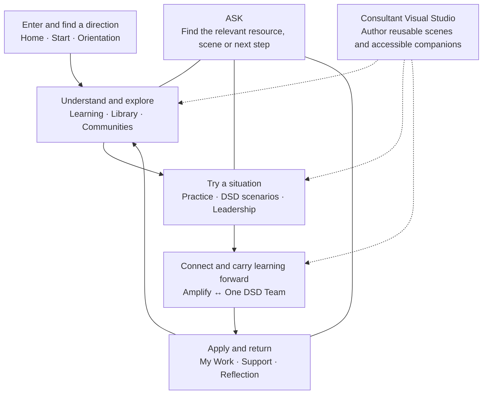

# One DHS / One DSD: multimedia opportunity map

> SUPERSEDED HISTORICAL MEMO. The owner excludes Blender altogether. Its former recommendations below are preserved source history, not active assignments. Follow `MULTIMEDIA-AUTHORING-STANDARD-2026-09-09.md` and current resource-level delivery receipts. Prototype navigation, endpoints and tool registration have been removed from active authoring.

Internal planning memo for Gary Banks. September 9, 2026.

## Recommendation

Create a small, reusable collection of visual learning experiences, each connected to an existing question, resource or practical tool. Start with participation in meetings, evidence in interviews, and access in service conversations. These three situations can connect foundations, intercultural development, leadership, the One DSD Team and Amplify without making every page longer.

Use Blender for places, people, staging and visible actions. Use accessible diagrams for relationships and processes; annotated documents for policy and work products; and existing audio where listening is useful. Media should let someone notice something, explore an option, or use what they learned. Connection, celebration and rest can also be worthwhile without producing an assignment.

This is an opportunity assessment, not a claim that the proposed media has been built or deployed. The standalone office experiment remains outside the program.

## Program map

The sequence is an invitation, not an enrollment requirement. Every destination remains directly available. ASK's media connections shown here are recommendations for later implementation; existing ASK reliability work remains deferred.

## What was reviewed

Three agents and the lead review divided the current local program by function. The review examined route implementations, shared components, resource definitions and structured content. It is not a browser verification of every destination, an external-source revalidation, or a line-by-line editorial review of every recovered lesson and chapter.

- Learning inventory: all 86 recovered course packs and 780 lessons were included in the structural inventory; 11 practice paths, 59 static resource definitions and 41 recovered community readings containing 1,209 chapters, plus the additional Deaf/DeafBlind/Hard of Hearing brief.
- DSD review: all 12 program profiles, 13 scenario definitions, seven Amplify pages, 12 gathering activities, Team and Learning Lab, three leadership entry paths, six capabilities and ten employee-life-cycle stages.
- Organizational entry: Orientation, Start, ERGs and all 30 Understanding DHS entries.
- Lead review: Home, About, Operationalizing Equity, Areas and domain connections, ASK, My Work, Support, consultant navigation and Visual Studio, contributor entry, and legacy route redirects. A supplemental review covers support and authoring route details.
- The linked specialist memos give exact source files, route-family accounting, media counts, limitations and additional opportunities. A route inventory accompanies this memo so aliases, dynamic templates and private tools are accounted for without treating every template as one content item.

The local inventory found 185 course image blocks using 122 distinct references, and 44 nonempty course-intro audio references with transcripts. Referenced covers, images and intro files exist locally. That is a file-existence check, not proof that each spoken word matches its transcript or that every live publication uses that asset. Two approved podcast files also exist locally. Forty-one `captioned-video` work-product labels describe text drafting exercises, not playable videos.

## Placement and priority

Priority reflects usefulness and reuse. There are no imposed delivery deadlines.

| Program area | Recommended experience | Why it belongs here | Result or connection | Format and readiness |
| --- | --- | --- | --- | --- |
| Home and About | A concise optional welcome: one real work question connects learning, practice and support | Helps a new visitor see the purpose without another wall of tiles | Orientation or a chosen next step | Short illustrated sequence or captioned welcome; proposed. Preserve the approved hero image and stillness. |
| Operationalizing Equity | One meeting or service-form example shown as situation, choice, effect and reflection | Makes the definition concrete and diplomatically focuses on the work | Existing Toolkit companion and practice | Three annotated frames plus readable example; high reuse, storyboard-ready. |
| Orientation and Understanding DHS | A small relationship map with an equivalent linked list | Makes the program and organizational context easier to navigate | Relevant division, resource or support route | Maintainable HTML/SVG; proposed. Keep changing responsibilities in sourced text. |
| Areas of work | A different useful visual for each kind of work: opportunity pathway, process map, engagement loop, evidence comparison | Shows what someone could actually work on within an area | Existing domain task and practice link | Diagrams and annotated examples; proposed. Do not duplicate all content at directory level. |
| Foundations and intercultural learning | Observe, interpret, inquire: a short scene paused at a meaningful decision | Lets learners distinguish evidence from assumptions and try respectful inquiry | Reflection and one practical question to use | Blender still sequence first, optional animation later; proposed. No IDI placement or progression inference. |
| Resource library and courses | Readable previews of actual tools; optional narrated explanations with matching transcripts | Makes resources tangible while preserving the original source | Open or adapt the actual resource | Reuse current images/audio first; add playable lesson-media support before promising videos. |
| Practice and DSD scenarios | Replay a team meeting with different participation conditions | Shows what changes when people can contribute before, during and after a meeting | Meeting-adjustment note, agenda or idea brief | Strong first Blender candidate. Branching interaction is additional work. |
| Leadership | Interview evidence, mentoring support and usable succession handovers | Connects DEIA with concrete decisions across the employee life cycle | Existing rubric, development map or continuity plan | Interview staging in Blender; rubric and handover in editable text. |
| DSD service work | Follow a fictional person through a form, question and usable next step | Makes access barriers and missing handoffs visible | Burden/access map and a question for the appropriate role | Scene plus accessible process diagram; proposed. Any real procedural claim needs its current source. |
| Amplify and One DSD Team | Show an idea moving in both directions, with an actual response coming back | Makes contribution and follow-through visible while preserving voluntary connection | Existing idea brief, gathering plan and report-back | Simple step diagram with illustrative scenes; high reuse. No automatic recording or sending. |
| Minnesota Communities and ERGs | Attributed community perspectives, selected audio and contextual visual essays | Brings people’s own explanations into the learning rather than using appearance as cultural shorthand | Reflection, informed inquiry and current group links | Prefer authentic contributed material. Do not manufacture first-person testimony or group endorsements. |
| My Work and Support | A private before/after work-example view and a compact help-route map | Connects what someone tried to what they learned and where they can turn next | Current saved notes, reflection or voluntary result form | Text/diagram preferred; no new monitoring, scoring or sensitive uploads implied. |
| ASK | Suggest a relevant scene or exact transcript segment alongside the substantive answer | Lets someone begin with a question and find a useful experience | Stable resource link, transcript and practical follow-up | Later integration after resource and answer reliability verification. ASK must not invent media content or timestamps. |
| Consultant and contributor workspaces | Storyboard, scene, preview, accessible companion, destination and receipt kept together | Supports repeatable authoring and reuse without placing author controls on staff pages | Traceable published resource and recoverable source project | First local Blender connection is verified; see the separate verification receipt. Full media catalog and publication integration are future work. |

## A reusable first collection

1. **The contribution that was missed.** A written observation is overlooked as a meeting moves to a decision. Learners can examine the situation and compare a better participation arrangement. Reuse in intercultural foundations, meeting practice, Learning Lab and Amplify facilitation.
2. **What supports that rating?** An interview panel compares a first impression with actual job-related evidence. Reuse in leadership, bias learning and inclusive hiring. Neither gaze nor identity explains a person's competence or motives.
3. **A next step that works.** A person describes a barrier to completing a form. Compare different responses and a clear handoff. Reuse in service design, accessibility, language access and DSD scenarios.
4. **The idea comes back.** Colleagues choose to carry a question forward, receive a response and learn what remains open. Reuse on both Amplify and Team pages. A conversation can also remain a conversation.
5. **Someone else can use this.** A colleague tries a fictional handover and identifies missing information. Reuse in succession planning, mentoring and leadership continuity.

Each scene is one maintained source, with links from several places. A learner can read its full description and dialogue, choose among the same options, receive equivalent feedback and reach the same practical tool without watching a video.

## Authoring and access

For every proposed asset, keep a title, purpose, intended placements, source project, descriptive text, transcript/captions where applicable, source/rights information, version and actual verification result. These are production details for the consultant workspace, not instructions scattered through staff pages. Owner-curated content retains the approval already provided; this proposal adds no new approval committee.

Speech and meaningful sound need accurate captions; important visual information needs description, and the player needs usable controls. Build these with the media rather than treating them as an afterthought. A transcript alone does not establish every applicable accessibility requirement. [W3C guidance on accessible audio and video](https://www.w3.org/WAI/media/av/) and [describing visual information](https://www.w3.org/WAI/media/av/description/).

Blender provides modeling, animation, rendering and Python automation, which makes it suitable for reusable authored environments. That capability does not mean the application already offers finished videos, character animation or a live desktop bridge. [Blender features](https://www.blender.org/features/) and [rendering](https://www.blender.org/features/rendering/).

Keep the staff experience calm: no autoplay, no moving hero, no mandatory watching, no hover-only information and no decorative 3D that slows a simple task. Use clear playback controls and an equivalent readable route. Show one useful invitation where it fits; place detailed media on the destination page.

Learning remains voluntary and open. Participation does not earn required DHS training credit unless management, a director or DHS leadership grants the exception. Media completion is not proof of intercultural development, changed work practice or an IDI orientation. Evidence of usefulness should concern a voluntary practice attempt or a work improvement, never a ranking of people.

## Completion and evidence for this review

This memo and the specialist appendices are the deliverables for the multimedia opportunity assessment. They propose additions; they do not claim new multimedia is published. Original program content and the approved landing-page image were not changed by this assessment.

- [Learning and resources assessment](MULTIMEDIA-LEARNING-OPPORTUNITIES-2026-09-09.md)
- [DSD, leadership, engagement and orientation assessment](MULTIMEDIA-DSD-OPPORTUNITIES-2026-09-09.md)
- [Support and authoring supplement](MULTIMEDIA-SUPPORT-AUTHORING-2026-09-09.md)
- [Route inventory](../evidence/multimedia-review-2026-09-09/routes.json)
